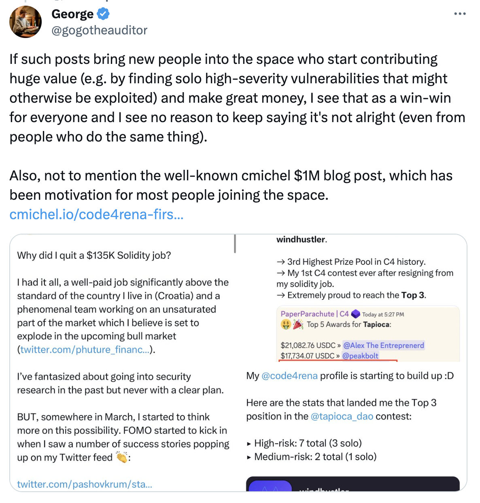
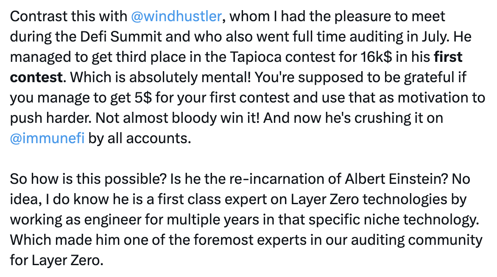
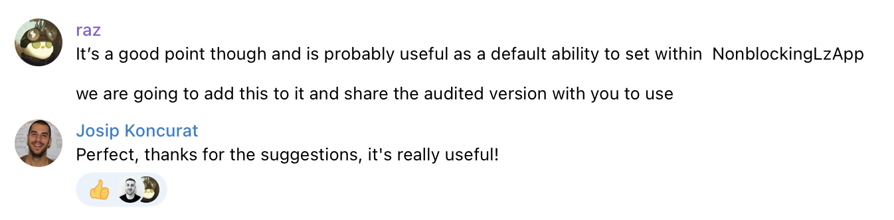
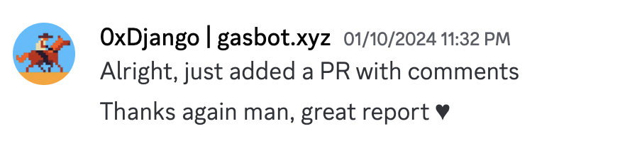
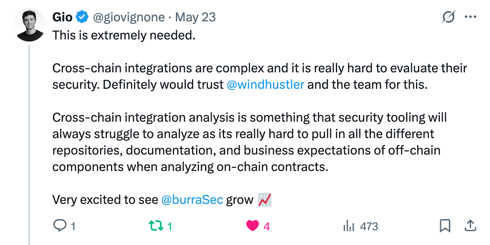

# Audit Portfolio - Windhustler

Reach out for consulting and security reviews via [**X**](https://twitter.com/windhustler), or **Discord**/**Telegram** @windhustler.

## Private Engagements

### 2025

### January 2025
1. [Tether OFT - Cross chain USDT](./team/Tether-OFT-Security-Review.pdf)
2. [Puffer - ERC20 Staking](./team/Puffer-Staking-Security-Review.pdf)
3. [Azuki - Anime claimer using lzRead functionality](./team/Anime-Claimer-Security-Review.pdf)

### February 2025
4. [Yuga Labs - NFT Mirror](./team/2025-02-05-YugaLabs-NFT-Shadows.pdf)
5. Dinero - Cross-chain syncing
6. Berachain - NFT-based vesting streams
7. MyShell - OFT token
8. [Stream - Yield bearing vaults](./team/Stream-Zenith-Security-Review.pdf)
9. Satoshi - Cross-chain staking farm

### March 2025
10. Khalani - Intents protocol

### April 2024
11. [PaintSwap - OFT token](./team/Paintswap-Security-Review.pdf)

### 2024

1. [GasBotV2 - Cross-chain refuel protocol](./solo/GasbotV2-Security-Review.md)
2. [ProphetBots Router - Custom Univ2 router](./solo/Prophet-Router-Security-Review.md)
3. [LayerZero V2 - Omnichain interoperability rotocol](./solo/LayerZero-V2-Security-Review.pdf)
4. [Phuture V2- Omnichain index protocol](./team/Phuture-V2-Security-Review.pdf)
5. [DYAD - Overcollateralized stablecoin](./team/DYAD-Security-Review.pdf)
6. [Wagmi Leverage - Leverage protocol on UniV3](./team/Wagmi-Security-Review.pdf)
7. [PING OFT - ERC20 transferable across chains via LayerZeroV2](./solo/PING-Security-Review.pdf)
8. [Euler Finance - Reward streams](./team/Euler-Finance-Security-Review.pdf)
9. [TapiocaDAO - Omnichain money market powered by LayerZero](./solo/TapiocaDAO-Security-Review.pdf)
10. [TitanX - X28 burn and auction contract](./team/X28-Hunter-Security-Review.pdf)
11. [Chainlink EMA - Chainlink EMA oracle](./team/Bailsec-defi.money-ChainlinkEMA.pdf)
12. PsyDAO - NFT marketplace
13. [Drips - LayerZeroV2 integration](./team/Drips-Security-Review.pdf)
14. [Clave Ztake - Staking rewards](./team/Clave-Ztake-Security-Review.pdf)
15. [Parallel Bridge - OFT with limits and fees](./team/Bailsec-ParallelBridge-BridgeableToken-Security-Review.pdf)
16. QuantumFair - Raffle marketplace for public goods
17. [TapiocaDAO - StargateV2 integration](./solo/TapiocaDAO-StargateV2-Security-Review.pdf)
18. Decent - Cross-chain swaps
19. [OFTExtended - OFT with limits and fees](./solo/OFTExtended-Security-Review.pdf)
20. [Superform core - Cross-chain liquidity protocol](./team/Superform-core-Security-Review.pdf)
21. Gravity - Derivatives exchange on zkSync
22. [Clave - Email Recovery on ZkSync](./team/Clave-EmailRecovery-Security-Review.pdf)
23. [Velodrome - Expansion to OP chains](./team/Velodrome-Security-Review.pdf) 
24. IVX Finance - Decentralized options AMM
25. [MRG - Bitcoin staking](./team/Mrg-Cantina-Security-Review.pdf)
26. [Bitcorn OFT - USDC bridging from Ethereum to Corn](./solo/Bitcorn-OFT-Security-Review.pdf)
27. PaintSwap - OFT token

## Competitive Audits

| Duration             | Contest                                                                       | Description                                                                                 | Ranking |
|:---------------------|:------------------------------------------------------------------------------|:--------------------------------------------------------------------------------------------|:-------:|
| 23 Feb - 15 Mar 2024 | [Tapioca DAO Sherlock](./reports/Tapioca-DAO-Sherlock-Security-Review.md)     | Omnichain money market powered by LayerZero                                                 |   6th   |
| 24 Jan - 07 Feb 2024 | [Catalyst Exchange](./reports/Catalyst-Exchange-Security-Review.md)           | Cross-chain liquidity protocol and generalized incentive mechanism for AMBs                 |    -    |
| 19 Jan - 23 Jan 2024 | [Decent](./reports/Decent-Security-Review.md)                                 | Cross-chain token transactions with LayerZero/Stargate                                      |   1st   |
| 16 Oct - 28 Oct 2023 | [Aloe](./reports/Aloe-Security-Review.md)                                     | Permissionless lending built on top of Uniswap V3                                           |   1st   |
| 5 Oct - 11 Oct 2023  | [ENS](./reports/ENS-Security-Review.md)                                       | ERC20Votes compatible multi-delegation contract to manage user votings                      |    -    |
| 22 Sep - 6 Oct 2023  | [Maia DAO - Ulysses](./reports/Maia-DAO-Ulysses-Security-Review.md)           | Omnichain liquidity and execution platform built on top of LayerZero                        |    -    |
| 25 Aug - 12 Sep 2023 | [Chainlink Staking v0.2](./reports/Chainlink-Staking-v0.2-Security-Review.md) | The 2nd iteration of Chainlink Staking                                                      |    -    |
| 21 Aug - 28 Aug 2023 | [Shell Protocol](./reports/Shell-Protocol-Proteus-Security-Review.md)         | Proteus AMM Engine, a hybrid between a Balancer liquidity bootstrapping pool and Uniswap v3 |    -    |
| 7 Aug - 10 Aug 2023  | [Canto veRWA](./reports/Canto-veRWA-Security-Review.md)                       | Incentivization primitive for real world assets on Canto                                    |    -    |
| 5 Jul - 4 Aug 2023   | [Tapioca DAO Code4rena](./reports/Tapioca-DAO-C4-Security-Review.md)          | Omnichain money market powered by LayerZero                                                 |   3rd   |

## Bug Bounty

| Program                                                                                                              | Description                                                       | Severity  | Writeup  |
|:---------------------------------------------------------------------------------------------------------------------|:------------------------------------------------------------------|:---------:|:--------:|
| [PancakeSwap](https://immunefi.com/bounty/pancakeswap/)                                                              | DoS attack on the CakeOFTs disabling cross-chain communication    |  Medium   |    -     |
| [Radiant Capital](https://immunefi.com/bounty/radiant/)                                                              | DoS attack on the RadiantOFTs disabling cross-chain communication |  Medium   |    -     |
| [Lybra Finance V2](https://immunefi.com/bounty/lybrafinance/)                                                        | DoS attack on the peUSD disabling cross-chain communication       |  Medium   |    -     |
| [Premia Finance](https://app.hats.finance/bug-bounties/premia-bug-bounty-0xdaf2a62e238001cbc595628e46984734990e2c4d) | DoS attack on the vxPremia disabling cross-chain communication    |  Medium   |    -     |

## Feedback

What people say about my work:

  
  
  
  

  
  
  

